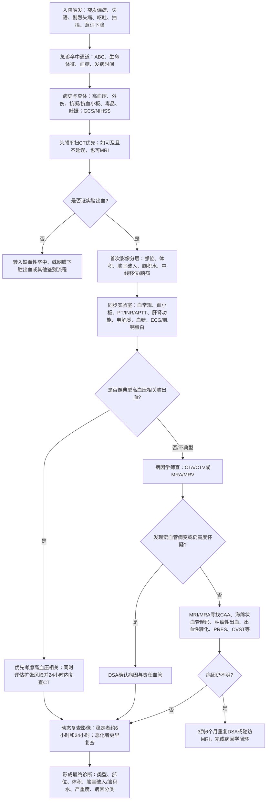

# 脑出血诊断流程调研

## 适用范围与说明

本文件所称“脑出血”，主要指非外伤性脑实质内出血，即自发性脑出血或自发性脑出血性卒中，英文常对应 spontaneous intracerebral hemorrhage，简称 ICH。

本文件不适用于以下情形：

- 外伤性脑出血
- 单纯蛛网膜下腔出血
- 单纯硬膜下或硬膜外血肿

需要特别说明的是，临床上的“诊断结束”通常分为两层：

- 第一层是急诊确诊，即尽快确认是不是脑出血，以及严重到什么程度。
- 第二层是病因学闭环，即尽量明确为什么出血，必要时把病因学检查延续到住院后期或出院后随访。

本文是依据截至 2026-03-19 可公开核对的中国和国际权威指南整理而成。其中最新中国国家级规范为《脑血管病防治指南（2024年版）》；病因学筛查的分层细节主要结合《中国脑血管病临床管理指南（第2版）》脑出血章节和 AHA/ASA 2022 指南综合归纳。文中的“主流程图”和“诊断结束标准”为整合表达，不是某一条指南的逐字原文。

## 核心结论

脑出血的标准诊断路径不是“出现症状后拍一次 CT 就完成”，而是一个连续流程：

1. 识别入院症状并启动卒中急诊通道。
2. 先完成生命支持、发病时间确认、病史采集和神经系统评分。
3. 以头颅平扫 CT 为主尽快确诊脑出血。
4. 同步判断血肿部位、体积、脑室破入、脑积水、脑疝风险和早期扩张风险。
5. 结合年龄、出血部位、既往高血压史和影像学特征，区分“典型高血压相关脑出血”与“需积极追查继发病因的脑出血”。
6. 用 CTA、CTV、MRA、MRV、MRI 和必要时 DSA 完成病因学筛查。
7. 在 24 小时内完成动态复查影像；病情不稳定时更早复查。
8. 最终把诊断写完整：脑出血类型、部位、体积、严重程度、并发征象和病因分类。

## 主要流程图

## 分步流程详述

### 1. 入院触发：哪些症状提示要按脑出血流程处理

脑出血最常见的首发表现是急性、突然发生的神经系统症状。按中国 2024 国家指南和近年脑出血管理指南，临床上应高度警惕以下表现：

- 突发偏瘫或偏身无力
- 突发失语或言语不清
- 突发偏身感觉减退
- 突发剧烈头痛
- 恶心、呕吐
- 抽搐
- 嗜睡、意识障碍或昏迷
- 血压明显升高

如果症状是“秒到分钟级”起病，伴进行性意识下降、呕吐或头痛，尤其要优先排除脑出血。

### 2. 急诊接诊：诊断流程开始前必须同步做的事

指南都强调，脑出血诊断和早期处置必须并行，而不是先把病因全部查完再开始管理。到院后通常应立即完成以下内容：

- 评估气道、呼吸、循环，即 ABC。
- 记录血压、心率、血氧、体温。
- 做指尖血糖，排除低血糖模拟卒中。
- 明确发病时间，或记录“最后一次正常时间”。
- 快速采集既往史，包括高血压、既往卒中、脑血管畸形、肿瘤、肝病、血液病。
- 记录用药史，重点是华法林、直接口服抗凝药、肝素、阿司匹林、氯吡格雷等。
- 询问可卡因、安非他明等拟交感药使用史。
- 适用时询问妊娠、产褥期和口服雌激素情况。

这一阶段的目标不是“定病因”，而是先回答：这是不是急性卒中；是否有立即危及生命的问题；是否存在明显的出血高危背景。

### 3. 神经系统查体：为后续影像和风险分层提供基线

急诊神经系统查体至少要建立三个基线：

- 意识水平：常用 GCS。
- 神经功能缺损程度：常用 NIHSS。
- 是否存在脑疝征象、脑干受压体征或病情快速恶化。

这一步的临床意义主要有三点：

- 决定监护级别和是否需要神经重症管理。
- 决定是否需要更频繁的复查影像。
- 为后续判断病情进展和治疗反应提供比较基础。

### 4. 首次影像学确诊：急诊首选平扫 CT

对于疑似脑出血患者，指南一致要求尽快完成头颅影像。急诊实践中以平扫 CT 为首选，因为速度快、可及性高、对急性出血识别可靠。MRI 在具备条件且不会延误诊疗时也可以用于确诊。

首次影像不只是在“看见血肿”，还要同时回答以下问题：

- 出血是否位于脑实质内。
- 出血部位是脑叶、基底节、丘脑、脑干还是小脑。
- 估计血肿体积。
- 是否破入脑室。
- 是否伴蛛网膜下腔积血。
- 是否存在脑积水。
- 是否存在明显水肿、中线移位或脑疝风险。

在很多中心，血肿体积会用 ABC/2 等方法做床旁估算，便于快速分层。

### 5. 首次影像后的第一轮判断：典型还是不典型

确诊“有脑出血”后，临床上会立即进入第二个问题：这像不像典型高血压相关脑出血。

更符合高血压相关模式的线索通常包括：

- 有明确长期高血压病史。
- 出血位于深部结构，如基底节、丘脑、脑桥、小脑。
- 年龄偏大。
- 没有提示结构性病变的明显异常表现。

更应高度怀疑继发性病因的线索通常包括：

- 中青年患者。
- 脑叶出血。
- 原发性脑室出血。
- 深部或幕下出血但没有高血压史。
- 既往反复出血或多灶出血。
- 临床上伴异常头痛模式、癫痫、静脉窦血栓风险、肿瘤或凝血异常线索。

这一步非常关键，因为它决定后面是“以高血压相关为主线管理”，还是“尽快进入积极病因学筛查”。

### 6. 同步实验室检查：确诊脑出血后也必须尽快补齐

实验室检查不是辅助项，而是标准诊断链条的一部分。常规应尽快完成：

- 血常规和血小板计数
- PT、INR、APTT
- 肝功能、肾功能
- 电解质
- 血糖
- 心电图和必要时肌钙蛋白

按病情选择的检查还包括：

- 毒物筛查
- 妊娠试验
- 与直接口服抗凝药相关的凝血检测
- 其他针对系统性疾病的检查

这些结果直接影响三个判断：

- 出血是否与药物或凝血障碍有关
- 是否存在系统性疾病背景
- 后续是否可以安全进行手术、介入或侵袭性操作

### 7. 病因学影像学筛查：何时做 CTA、CTV、MRI、DSA

这一部分是脑出血诊断中最容易被简化、但其实最重要的内容。

#### 7.1 CTA 或 CTV

中国 2024 国家指南提出，中青年自发性脑出血患者应进一步完善 CTA 或 MRA，并在必要时做 DSA。

中国卒中学会 2023 版管理指南把适应证细化得更清楚，常见的高提示场景包括：

- 脑叶出血且年龄小于 70 岁
- 深部或后颅窝出血且年龄小于 45 岁
- 深部或后颅窝出血，年龄 45 到 70 岁，但无高血压病史

在上述场景下，推荐做 CTA；如果怀疑静脉系统问题，可加做 CTV。

CTA 的价值主要有两类：

- 查病因，看是否存在动脉瘤、动静脉畸形、烟雾病样改变等大血管病变。
- 看扩张风险，例如“spot sign” 对早期血肿扩大风险评估有参考意义。

#### 7.2 MRI、MRA、MRV

当无创血管影像不能解释病因，或者需要进一步寻找非大血管性病因时，MRI 很重要。MRI 尤其适合寻找：

- 脑淀粉样血管病相关线索
- 海绵状血管畸形
- 肿瘤性出血
- 脑梗死出血性转化
- 可逆性后部白质脑病综合征
- 静脉窦或皮质静脉血栓

如果怀疑静脉窦血栓，除了 MRI，也可结合 MRV 或 CTV。

#### 7.3 DSA

DSA 仍然是确认某些宏血管病因的金标准。以下情况通常要考虑 DSA：

- CTA 或 MRA 已提示可疑血管病变，需要进一步确认
- 非侵入性检查阴性，但临床和影像仍高度怀疑结构性血管病变
- 原发性脑室出血等特殊场景

如果第一次 DSA 阴性，但患者年龄、出血部位或临床表现仍然强烈提示血管病变，指南允许在 3 到 6 个月后重复 DSA，因为初期血肿和血管痉挛可能掩盖真实病灶。

### 8. 动态复查：诊断并不会在第一次 CT 后停止

脑出血有一个非常关键的特点：血肿可能在早期继续扩大。因此，动态复查影像属于诊断过程的一部分，而不是单纯随访。

指南给出的实践原则可以概括为：

- 确诊后 24 小时内应完成复查头颅 CT。
- 如果患者神经功能恶化、GCS 下降、怀疑脑积水或脑疝，应更早复查。
- AHA 2022 提示，对于 GCS 大于 13 且病情稳定的患者，约 6 小时和 24 小时复查通常足以识别早期扩张。

动态复查的目标主要是确认：

- 血肿是否扩大
- 是否新发脑室出血
- 是否出现或加重脑积水
- 是否出现更明显的占位效应

### 9. 诊断完成时，病历里应当写清什么

从严谨角度看，一份完整的脑出血诊断不应只有“脑出血”三个字，而应尽量包括以下要素：

- 是否为自发性脑实质内出血
- 出血侧别和解剖部位
- 血肿体积或范围
- 是否破入脑室
- 是否伴蛛网膜下腔积血
- 是否伴脑积水
- 是否伴占位效应、中线移位或脑疝风险
- 神经功能严重程度，如 GCS、NIHSS 或 ICH score
- 最可能病因或病因分类
- 是否仍属于“未明原因脑出血”，以及后续病因学随访计划

一个较完整的诊断写法示例如下：

> 自发性左侧基底节脑出血，血肿约 28 mL，破入脑室，伴轻度脑积水；入院 GCS 11 分，ICH score 2 分；倾向高血压相关脑出血；需 24 小时内复查头颅 CT。

如果病因暂时不能确定，病历可写成：

> 自发性右额叶脑出血，病因待查；已完成 CTA，未见明确宏血管病变，拟进一步完善 MRI，并在恢复期视情况复查 DSA。

### 10. 什么时候才算真正“结束”

急诊层面的“结束”标准通常是：

- 已经用 CT 或 MRI 证实脑出血
- 已完成严重程度评估
- 已完成最基本的实验室和影像学分层
- 已决定下一步监护和治疗路径

病因学层面的“结束”标准通常是：

- 已明确高血压相关或其他可解释病因
- 或者已经完成当前阶段合理的病因学筛查
- 对仍未明确病因者，已制定明确的复查计划和随访节点

因此，很多患者的诊断在急诊当天只完成了第一层，在住院期间或出院后才完成第二层。

## 临床上最容易混淆的几点

### 1. “做了 CT”不等于“诊断全部完成”

CT 解决的是“有没有出血”和“严重不严重”，不一定解决“为什么出血”。尤其是年轻患者、脑叶出血或原发性脑室出血，病因学筛查很关键。

### 2. 腰穿不是脑实质出血的常规首诊工具

脑实质内出血的急诊确诊依赖 CT 或 MRI。腰穿更多用于 CT 阴性但仍高度怀疑蛛网膜下腔出血时，不是脑实质出血的常规首选确诊方式。

### 3. 病情稳定与否决定复查频率

同样是脑出血，病情稳定、意识清楚的患者与 GCS 下降、进行性恶化的患者，其复查影像节奏完全不同。诊断流程必须根据动态变化调整。

### 4. “高血压脑出血”是排他性较强的临床判断

高血压病史很常见，但并不意味着所有出血都能直接归因于高血压。年轻、脑叶、原发性脑室出血或影像不典型时，仍应积极追查结构性病因。

## 实务版诊断清单

如果要把脑出血诊断流程落成临床执行清单，可按以下顺序核对：

1. 是否已识别为急性卒中并启动急诊通道。
2. 是否已完成 ABC、生命体征和血糖。
3. 是否已记录发病时间或最后正常时间。
4. 是否已完成神经系统查体和 GCS、NIHSS 基线。
5. 是否已尽快完成头颅平扫 CT 或不延误的 MRI。
6. 是否已记录部位、体积、脑室破入、脑积水和占位效应。
7. 是否已完善血常规、血小板、凝血、肝肾功能、电解质、血糖和 ECG。
8. 是否已判断为典型还是不典型脑出血模式。
9. 是否已按适应证完成 CTA、CTV、MRI、MRA、MRV 或 DSA。
10. 是否已安排 24 小时内复查 CT，必要时更早复查。
11. 是否已形成完整诊断文字并明确病因学随访计划。

## 参考文献与来源

1. 国家卫生健康委. [脑血管病防治指南（2024年版）](https://www.nhc.gov.cn/ylyjs/zcwj/202412/ba037e931fff4870930f65ff667ea9ed/files/1736390751587_80714.pdf). 检索日期：2026-03-19。
2. 国家卫生健康委. [关于印发脑血管病防治指南（2024年版）的通知](https://www.nhc.gov.cn/ylyjs/zcwj/202412/ba037e931fff4870930f65ff667ea9ed.shtml). 检索日期：2026-03-19。
3. 中国卒中学会. 中国脑血管病临床管理指南（第2版）脑出血章节原刊页面. [中国卒中杂志官网](https://www.chinastroke.org.cn/EN/10.3969/j.issn.1673-5765.2023.09.007). 检索日期：2026-03-19。
4. Greenberg SM, et al. 2022 Guideline for the Management of Patients With Spontaneous Intracerebral Hemorrhage. [AHA/ASA 指南 PDF](https://cpr.heart.org/-/media/CPR2-Files/Private/2022-Guideline-for-the-Management-of-Patients-With-Spontaneous-Intracerebral-Hemorrhage-1.pdf). 检索日期：2026-03-19。
5. Greenberg SM, et al. [PubMed 条目](https://pubmed.ncbi.nlm.nih.gov/35579034/). 检索日期：2026-03-19。

## 使用提醒

本文件适合用于课程汇报、读书笔记、科室资料整理和流程梳理，不替代具体患者的临床诊疗决策。真正临床应用时，应以所在医院卒中中心规范、影像条件、神经外科资源和主管医生判断为准。
