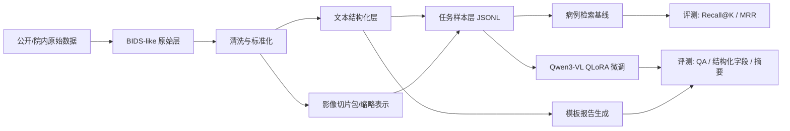

# 神经外科多模态技术路线调研 v1

## 0. 说明

本文基于仓库内新增论文集合的主题方向整理，并结合对应论文主页、官方代码仓库、模型文档与数据集页面，收敛出一条适合有限算力和有限数据条件下的最短闭环路线。目标不是一步做到“全神经外科大模型”，而是尽快形成从数据整理、样本构造、轻量微调到评测出数的工程闭环。

默认约束如下：

- 算力有限，优先假设 `1 x 24GB` 或 `1 x 48GB` 级别 GPU。
- 数据有限，优先假设短期内以公开数据为主，院内数据为补充。
- 当前阶段重目标闭环，不重平台化；先把数据 infra 做成可复用的文件规范和任务清单，再考虑服务化。

## 1. 结论先行

### 1.1 推荐主路线

最推荐的 v1 路线是：

`脑肿瘤 MRI -> 文本结构化 -> 样本标准化 -> 轻量多模态模型/检索模型 -> 评测闭环`

原因如下：

- 仓库内论文中，`TextBraTS`、`NOVA`、`M3D`、`BrainGPT`、`Qwen3-VL`、`Qwen3 Embedding`、`QLoRA` 这组材料天然可以拼出一条 MRI 多模态最小闭环。
- `TextBraTS` 和 `BraTS` 生态让脑肿瘤方向的公开数据基础明显强于“神经外科全病种”。
- `NOVA` 提供了脑 MRI 异常定位与临床推理 benchmark，适合做外部验证。
- `Qwen3-VL` 和 `Qwen3-Embedding` 可以把“视觉问答/报告生成/病例检索”统一到同一技术栈里。
- `QLoRA/LoRA/DoRA` 说明参数高效微调是现实可行的，不需要一开始就做重型全参训练。

### 1.2 不推荐的起步方式

以下路径不适合作为第一步：

- 一开始就做“全神经外科全病种多模态统一大模型”。
- 一开始就做原生 3D 端到端大模型训练。
- 一开始就重投 PACS/DICOMweb/在线服务系统，而没有先冻结数据结构和评测口径。
- 一开始就把主要目标定成“自由文本长报告生成”，而没有先完成结构化抽取、检索、问答等更容易量化的闭环任务。

### 1.3 推荐闭环目标

v1 只做 4 个可以快速出结果的任务：

1. 报告结构化抽取
2. 病例检索
3. 图文问答
4. 模板化报告摘要生成

其中：

- 报告结构化抽取负责把自由文本转成统一字段。
- 病例检索负责把“相似病例”与“可解释支撑证据”建立起来。
- 图文问答负责验证多模态模型是否真的有用。
- 模板化报告摘要生成比自由生成更容易控风险，也更适合有限数据阶段。

## 2. 从仓库论文集合收敛出的关键判断

以下结论是基于仓库内论文主题与其对应公开资料整理出的工程判断。

| 论文/主题 | 对本项目的直接启发 | 落地决策 |
| --- | --- | --- |
| `TextBraTS` | 脑肿瘤 MRI 与文本描述天然适合做配对样本与方法验证 | v1 优先病种定为脑肿瘤 |
| `NOVA` | 脑 MRI 的异常定位与临床推理 benchmark 很适合做外部评测 | v1 要保留外部 benchmark 验证 |
| `BrainGPT` | 脑 CT 报告生成与 FORTE/外部验证思路很有参考价值 | v2 可扩到脑出血 CT，但不作为 v1 主线 |
| `M3D` | 3D 医学多模态路线是长期方向，但数据和训练都更重 | 先借鉴数据格式和任务定义，不直接重走其完整训练路线 |
| `Med3D` | 3D 医学视觉表征适合做编码器 warm start | 若后续要做 3D encoder，可作为增强项 |
| `BiomedCLIP` / `ConVIRT` | 图文对比学习对检索很重要 | v1 检索任务要单独做，不依赖生成模型“顺带完成” |
| `LLaVA-Med` / `Med-Flamingo` | 医疗多模态指令数据可先采用消息格式统一管理 | 数据样本层统一采用消息式 JSONL |
| `LoRA` / `QLoRA` / `DoRA` | 低成本适配是现实主路 | v1 默认采用 QLoRA，DoRA 作为对照而不是默认 |
| `Qwen3-VL` | 通用多模态底座足以承担切片包级别的脑 MRI/CT 问答和摘要 | v1 多模态模型优先选 Qwen3-VL 2B/4B |
| `Qwen3 Embedding` | 病例检索、相似病例召回、报告检索可直接受益 | v1 必做 embedding 检索底座 |
| `RULE` | 医疗多模态 RAG 对事实性提升有帮助 | RAG 放在 v1.5，不放在最初闭环之前 |
| `Argus` | 3D 放射学报告生成评测说明“生成好看”不等于“临床靠谱” | v1 评测必须包含结构化指标，不只看 BLEU/ROUGE |

最重要的工程收敛只有一句话：

先做 `脑肿瘤 MRI + 结构化文本 + 检索/问答/模板摘要`，再考虑扩病种和长报告生成。

## 3. 推荐技术路线

### 3.1 路线总览



### 3.2 为什么不是先做 3D 端到端

因为当前目标是“最快从数据走到评测”：

- 3D 端到端训练对预处理、显存、batch、采样和评测链条要求都更高。
- 公开可直接拿来做图文配对与 benchmark 的 3D 神经外科数据并不算多。
- 对外可展示结果，优先应该来自一个稳定、可解释、可复现实验链条。

因此 v1 采用折中做法：

- 原始数据仍保留 3D 体数据。
- 训练与推理先使用 `2D/2.5D slice pack` 或 `三视图 montage` 输入多模态模型。
- 如果后续要扩展，再把 3D encoder 接入同一份数据 infra。

### 3.3 任务定义

#### 任务 A：报告结构化抽取

输入：

- 术前影像报告
- 手术记录
- 病理报告
- 随访记录

输出：

- 统一结构化字段 JSON

目标：

- 为检索、问答、模板摘要、训练样本生成提供统一标签层。

#### 任务 B：病例检索

输入：

- 结构化文本
- 可选的图像切片包描述

输出：

- Top-k 相似病例
- 相似病例证据字段

目标：

- 先把“相似病例召回”做稳定，这个任务对有限数据最友好，也最容易做出可解释结果。

#### 任务 C：图文问答

输入：

- 影像切片包
- 病史/结构化字段
- 问题模板

输出：

- 简短答案
- 证据片段

目标：

- 验证多模态模型是否比纯文本基线更有收益。

#### 任务 D：模板化报告摘要

输入：

- 影像切片包
- 结构化字段
- 相似病例检索结果

输出：

- 固定章节的临床摘要

目标：

- 控制生成空间，先把事实性和稳定性做出来。

### 3.4 模型建议

主推荐：

- 多模态模型：`Qwen3-VL-2B/4B`
- 检索向量模型：`Qwen3-Embedding`
- 微调方式：`QLoRA`
- 框架：`ms-swift`
- 医学图像预处理：`MONAI`

原因：

- `Qwen3-VL` 模型族体量可选，适合从小模型开始验证。
- `Qwen3-Embedding` 可以单独承担病例检索与相似样本召回。
- `ms-swift` 官方已经覆盖 Qwen 系列与多模态微调，适合最短落地路径。
- `MONAI` 是医学影像预处理与训练生态里的稳定选择。

资源分层建议：

- 如果显存非常紧：先不上微调，先做 `结构化抽取 + embedding 检索 + zero-shot 多模态问答`。
- 如果有 `24GB` 左右显存：上 `Qwen3-VL-2B/4B + QLoRA`，样本以三视图拼图和短回答为主。
- 如果有 `48GB+` 显存：可以增大上下文长度、提高图像分辨率，或者增加检索增强与对照实验。

### 3.5 为什么检索要先做

因为在有限数据条件下，检索有 3 个明显优势：

- 比自由生成更稳。
- 比纯分类更接近临床使用形态。
- 后续可以无缝升级成 `RULE` 那种多模态 RAG 方案。

## 4. 最小闭环 TODO

### P0：确定边界

输出物：

- 冻结 v1 病种与任务范围
- 冻结 v1 评测集定义

TODO：

1. 病种先冻结为 `脑肿瘤 MRI`
2. 脑出血 CT 记为 v2 并行候选，不进入 v1 主计划
3. 任务冻结为 `结构化抽取 + 病例检索 + 图文问答 + 模板摘要`
4. 评测冻结为 `内部 held-out + NOVA 外部 benchmark`

### P1：数据接入

输出物：

- 原始数据目录
- 统一 manifest
- train/val/test 切分

TODO：

1. 收集 `BraTS`、`TextBraTS`、`NOVA`、`UPenn-GBM`、`RadGraph-XL` 可用子集
2. 统一病例主键、研究主键、序列主键
3. 所有切分严格按 `patient_id` 做，避免泄漏
4. 将影像统一转成 `NIfTI + sidecar JSON` 或保留原始 DICOM 后派生 NIfTI
5. 生成 `study_manifest.parquet`

### P2：文本结构化

输出物：

- `report_structured.jsonl`
- 抽取质量人工检查表

TODO：

1. 先规则抽取高稳定字段
2. 再用 LLM 补长尾字段
3. 字段命名统一成固定枚举
4. 对缺失值、冲突值、否定表达做单独标注
5. 抽样人工核验至少 `100` 条

### P3：任务样本生成

输出物：

- 检索任务样本
- QA 样本
- 模板摘要样本

TODO：

1. 从 3D MRI 生成三视图拼图或代表性切片包
2. 从结构化字段合成问答 prompt
3. 生成检索 query 与 gold case 列表
4. 将所有任务统一转成消息式 JSONL
5. 冻结一版 `v1_eval.jsonl`

### P4：基线与微调

输出物：

- 检索基线
- zero-shot VLM 基线
- QLoRA 微调实验

TODO：

1. 先做纯文本 embedding 检索基线
2. 再做文本+影像 caption/摘要 zero-shot 基线
3. 最后做 `Qwen3-VL + QLoRA`
4. 记录每个实验的数据版本、参数、评测结果

### P5：评测与复盘

输出物：

- v1 结果表
- 下一阶段增量计划

TODO：

1. 结构化抽取看字段级 F1
2. 检索看 `Recall@k`、`MRR`
3. QA 看 `Exact Match/F1` 和专家抽样
4. 摘要看结构字段覆盖率与事实错误率
5. 外部 benchmark 用 `NOVA`

## 5. 数据 infra 设计

### 5.1 设计原则

- 先做“文件规范 + manifest + 样本层”，不做重平台。
- 影像组织尽量贴近 `BIDS` 思想，方便后续扩展。
- 任务样本统一为 `JSONL`，方便直接喂给 `ms-swift` 或转换到其他框架。
- 原始层、结构化层、任务层分开，避免互相污染。
- 每次样本生成都带版本号和数据来源追踪。

### 5.2 推荐目录结构

```text
data/
  raw/
    brats/
    textbrats/
    nova/
    upenn_gbm/
    radgraph_xl/
  staging/
    imaging/
      nifti/
      slice_packs/
    reports/
      reports_raw.jsonl
      reports_structured.jsonl
  manifests/
    patients.parquet
    studies.parquet
    series.parquet
    splits/
      train_ids.txt
      val_ids.txt
      test_ids.txt
  tasks/
    retrieval/
      train.jsonl
      val.jsonl
      test.jsonl
    qa/
      train.jsonl
      val.jsonl
      test.jsonl
    summary/
      train.jsonl
      val.jsonl
      test.jsonl
  eval/
    internal_v1.jsonl
    nova_eval.jsonl
```

### 5.3 核心实体

建议至少冻结 6 类实体：

1. `patient`
2. `study`
3. `series`
4. `report`
5. `annotation`
6. `task_sample`

### 5.4 study manifest 建议字段

| 字段 | 类型 | 说明 |
| --- | --- | --- |
| `case_id` | string | 全局唯一病例 ID |
| `patient_id` | string | 患者级唯一 ID |
| `dataset_source` | string | 数据来源，如 `textbrats` |
| `disease_group` | string | 病种，如 `brain_tumor` |
| `study_uid` | string | 检查级 ID |
| `modality` | string | `MRI` / `CT` |
| `series_list` | array[string] | 序列列表 |
| `report_id` | string | 关联报告 ID |
| `path_nifti` | string | 标准化影像路径 |
| `path_slice_pack` | string | 切片包路径 |
| `split` | string | `train` / `val` / `test` |
| `label_primary` | string | 主标签 |
| `label_secondary` | array[string] | 次级标签 |
| `has_bbox` | bool | 是否带定位标注 |
| `has_seg` | bool | 是否带分割标注 |
| `has_followup` | bool | 是否带随访信息 |
| `license` | string | 数据许可说明 |
| `version` | string | manifest 版本 |

### 5.5 report_structured 建议字段

结构化字段不要一开始做得太大，v1 建议先冻结以下字段：

| 字段 | 说明 |
| --- | --- |
| `primary_diagnosis` | 主诊断 |
| `disease_stage_or_grade` | 分级，如 `WHO 4` |
| `lesion_location` | 病灶部位 |
| `lesion_side` | 左/右/双侧/中线 |
| `lesion_size` | 病灶大小 |
| `edema` | 水肿情况 |
| `mass_effect` | 占位效应/中线移位 |
| `enhancement_pattern` | 强化模式 |
| `necrosis_or_hemorrhage` | 坏死或出血特征 |
| `surgery_type` | 手术方式 |
| `pathology` | 病理结论 |
| `followup_outcome` | 随访结果 |
| `evidence_spans` | 对应原文证据片段 |
| `extractor` | 抽取方法版本 |
| `quality_flag` | 质量状态 |

### 5.6 任务样本统一格式

内部 canonical 格式建议统一成一套消息式 JSONL，再根据框架转换。

字段建议：

| 字段 | 说明 |
| --- | --- |
| `id` | 样本唯一 ID |
| `task` | `retrieval` / `qa` / `summary` |
| `case_id` | 对应病例 |
| `images` | 图像路径列表 |
| `messages` | 对话消息 |
| `target_struct` | 目标结构化字段 |
| `meta` | 额外元数据 |

这样做的好处：

- 直接兼容 `ms-swift` 风格的数据组织。
- 以后要转到 `LLaMA-Factory`、`OpenAI jsonl`、自定义 loader 都比较容易。

### 5.7 为什么 v1 不建议上数据库

因为当前数据规模和任务复杂度，都还不到必须先建数据库服务的阶段。此时更重要的是：

- schema 稳定
- manifest 稳定
- split 稳定
- 评测集冻结

只要这四件事没冻结，先上数据库通常只会增加摩擦。

## 6. 数据 infra TODO 清单

这一部分是本项目最应该集中精力的地方。

### 6.1 原始数据接入

1. 建立数据来源登记表
2. 记录每个数据集的许可、访问方式、下载脚本位置
3. 固定原始目录命名
4. 统一病例 ID 规则
5. 保留原始 checksum

### 6.2 影像标准化

1. 明确 MRI 序列优先级，如 `T1`, `T1CE`, `T2`, `FLAIR`
2. 固定重采样 spacing、方向、裁剪和强度归一化策略
3. 生成三视图 montage 或 slice pack
4. 将预处理参数写入 sidecar JSON
5. 对失败样本建立 error manifest

### 6.3 文本接入与清洗

1. 分开存储原始报告、清洗报告、结构化报告
2. 处理模板噪声、重复 header、空字段
3. 标记否定、待排、术后状态、复发状态
4. 对多来源文本保留时间戳和来源字段
5. 建立人工核验 sample list

### 6.4 结构化抽取

1. 先列字段字典和枚举表
2. 再做规则抽取 baseline
3. 再接 LLM 抽取补齐长尾
4. 给每个字段保留证据 span
5. 抽取结果写入 `report_structured.jsonl`

### 6.5 样本生成

1. 将结构化字段转成 QA prompt
2. 将病例对转成检索 query-target
3. 将结构化字段转成模板摘要 gold
4. 明确每条样本能追溯回原始影像和原始文本
5. 生成数据版本号

### 6.6 质量控制

1. 检查 patient 级泄漏
2. 检查路径失效和文件缺失
3. 检查结构化字段为空率
4. 检查标签分布偏斜
5. 检查 train/val/test 来源不均衡

### 6.7 评测冻结

1. 冻结内部 `test` 集
2. 冻结 `NOVA` 外部评测脚本
3. 冻结评测模板与输出 JSON 格式
4. 每次实验只读评测集，不再改标签
5. 记录结果表和失败案例

## 7. 推荐可用数据清单

下面只列和当前目标最相关、最能服务闭环的公开数据与数据源。

| 数据/资源 | 模态 | 角色 | 建议优先级 | 备注 |
| --- | --- | --- | --- | --- |
| `BraTS` | MRI + 分割 | 脑肿瘤影像主干数据 | 高 | 适合做图像底座与病灶区域辅助 |
| `TextBraTS` | MRI + 文本 | 脑肿瘤图文配对主数据 | 最高 | 最适合 v1 的核心数据 |
| `NOVA` | 脑 MRI + 定位/推理 | 外部 benchmark | 最高 | 用于外部验证最有价值 |
| `RadGraph-XL` | 放射学报告结构化标注 | 文本结构化监督 | 高 | 可借其 schema 和评测思路 |
| `UPenn-GBM` | MRI + 临床信息 | 扩展病例库 | 中 | 适合做检索与泛化验证 |
| `RSNA ICH` | 头 CT + 出血标签 | 脑出血 v2 数据 | 中 | 适合作为脑出血路径基座 |
| `CQ500` | 头 CT + 头颅异常标签 | 脑出血/头 CT 外部验证 | 中 | 更适合 v2 的脑 CT 路线 |
| `M3D-Cap` / `M3D-VQA` | 3D 医学图文/QA | 通用医学多模态 warm-up | 中 | 不是神经外科专用，但可借指令格式 |
| `LLaVA-Med` | 医疗图文指令 | 通用医学多模态 warm-up | 中 | 可借 prompt 风格，不建议当主数据 |

### 7.1 对“结构化医疗提示数据”的具体建议

如果目标是服务整体神经外科主题，最有价值的结构化提示数据不是泛泛收集所有医疗 QA，而是优先做以下三类：

第一类：原生神经外科图文配对数据

- `TextBraTS`
- `NOVA`
- 未来的院内脑肿瘤/脑出血配对数据

第二类：神经影像报告结构化数据

- `RadGraph-XL` 可作为报告结构化方法和字段设计的重要参考
- 仓库内 PPT 第 3 页提到的结构化字段完全可以按此思路推进

第三类：可合成的结构化 prompt 数据

来自：

- `BraTS` 分割标签
- `RSNA ICH` 出血标签
- `CQ500` 标签与结论
- `UPenn-GBM` 临床字段

通过模板可合成的问题包括：

- “病灶位于哪里？”
- “是否存在明显中线移位？”
- “最可能的诊断方向是什么？”
- “和哪类训练病例最接近？”

这一类非常适合在公开数据不足时快速扩充训练样本。

## 8. 推荐开源框架与格式

### 8.1 首选框架

`ms-swift`

原因：

- Qwen 系模型适配直接
- 多模态支持成熟
- 自定义数据集门槛较低
- 便于快速进入 QLoRA 实验

### 8.2 次选框架

`LLaMA-Factory`

原因：

- 社区活跃
- 多种数据格式兼容
- 适合后续补充对照实验

### 8.3 影像处理框架

`MONAI`

原因：

- 医学影像预处理与训练生态成熟
- 与 NIfTI、3D 体数据、裁剪、重采样等流程天然兼容

### 8.4 内部格式原则

无论最终用哪个训练框架，内部都建议坚持：

- 影像层：`BIDS-like`
- manifest 层：`parquet/jsonl`
- 任务层：`message-style jsonl`

这样能把“数据 infra”和“具体训练框架”解耦。

## 9. 一周内最值得先做的事

1. 把 v1 病种正式冻结为 `脑肿瘤 MRI`
2. 建立 `data/manifests/studies.parquet` 字段定义
3. 先做 `report_structured.jsonl` 的 schema 和 20 条人工标注样例
4. 接入 `TextBraTS` 与 `BraTS`
5. 基于结构化字段先做 embedding 检索 baseline
6. 生成第一版 `qa/train.jsonl`
7. 在 `Qwen3-VL-2B/4B + QLoRA` 上跑最小实验
8. 用 `NOVA` 冻结外部评测方式

## 10. 参考链接

模型与框架：

- Qwen3-VL 技术报告: https://huggingface.co/papers/2508.06072
- Qwen3-Embedding 模型卡: https://huggingface.co/Qwen/Qwen3-Embedding-4B
- ms-swift 官方仓库: https://github.com/modelscope/ms-swift
- LLaMA-Factory 数据集文档: https://llamafactory.readthedocs.io/en/latest/getting_started/data_preparation.html
- QLoRA 论文: https://arxiv.org/abs/2305.14314
- LoRA 论文: https://arxiv.org/abs/2106.09685
- DoRA 论文: https://arxiv.org/abs/2402.09353
- MONAI: https://monai.io/

数据与 benchmark：

- BraTS: https://www.med.upenn.edu/cbica/brats2020/data.html
- TextBraTS 官方仓库: https://github.com/WeiXinYuan/TextBraTS
- NOVA 官方仓库: https://github.com/flyingluohaotu/NOVA
- UPenn-GBM: https://www.cancerimagingarchive.net/collection/upenn-gbm/
- RadGraph-XL: https://physionet.org/content/radgraph-xl/
- RSNA Intracranial Hemorrhage: https://www.rsna.org/education/ai-resources-and-training/ai-image-challenge/brain-ct-hemorrhage-challenge
- CQ500 介绍: https://www.qure.ai/product/cq500

相关路线论文/项目：

- M3D 官方仓库: https://github.com/BAAI-DCAI/M3D
- LLaVA-Med 官方仓库: https://github.com/microsoft/LLaVA-Med
- BiomedCLIP 官方仓库: https://github.com/microsoft/BiomedCLIP-PubMedBERT_256-vit_base_patch16_224
- BrainGPT 论文页面: https://pmc.ncbi.nlm.nih.gov/articles/PMC12292164/
- RULE 论文: https://arxiv.org/abs/2504.00830
- Argus benchmark: https://github.com/bowang-lab/Argus
- BIDS 标准: https://bids.neuroimaging.io/

## 11. 最终建议

如果只保留一句执行建议，就是：

先把 `TextBraTS/BraTS -> 结构化字段 -> 检索 -> Qwen3-VL 轻量微调 -> NOVA 评测` 这条链路打通，再扩到脑出血 CT 和更重的 3D 路线。
